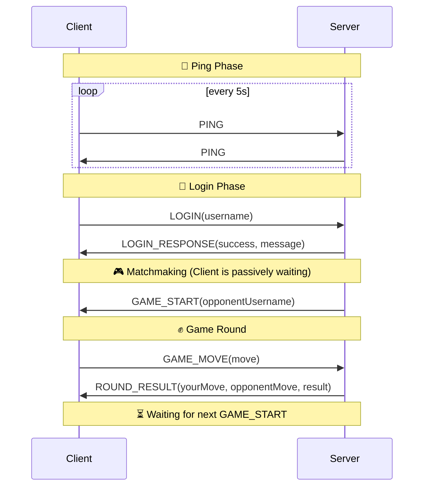

# 🎮 Rock-Paper-Scissors Communication Protocol

This protocol defines how a **Java client** and **server** communicate using object serialization in a multiplayer
Rock-Paper-Scissors game. It emphasizes a **ping-based connection** with minimal state messaging.

---

##  Message Types

| MessageType      | Direction       | Description                                            |
|------------------|-----------------|--------------------------------------------------------|
| `PING`           | Client ⇄ Server | Maintain connection between both parties               |
| `LOGIN`          | Client → Server | Sends username to log in                               |
| `LOGIN_RESPONSE` | Server → Client | Informs about login success/failure                    |
| `GAME_START`     | Server → Client | Match found, game is starting                          |
| `GAME_MOVE`      | Client → Server | Player sends chosen move (Rock/Paper/Scissors)         |
| `ROUND_RESULT`   | Server → Client | Sends round result (moves and outcome)                 |
| `DISCONNECT`     | Server → Client | Server instructs client to disconnect                  |
| `Terminate`      | Client → Server | Client notifies server it is disconnecting voluntarily |
| `ERROR`          | Server ⇄ Client | General error or unexpected behavior                   |

---

## 📬 Message Specifications

### 🔄 Ping (`PING`)

**Purpose**: Both client and server use `PING` messages to verify the connection is alive.

- **Direction**: Bidirectional
- **Payload**: None
- **Interval**: Regular ping intervals (e.g. every 5 seconds)

---

### 🔐 Login (`LOGIN`)

**Purpose**: Initiate login using a username.

- **Direction**: Client → Server
- **Payload**:
    - `username`: String (must be unique)
    - `password`: Hash

---

### ✅ Login Response (`LOGIN_RESPONSE`)

**Purpose**: Confirm login success or failure.

- **Direction**: Server → Client
- **Payload**:
    - `success`: Boolean
    - `message`: Human-readable explanation

---

### 🎮 Game Start (`GAME_START`)

**Purpose**: Inform client that a match has been found and the game is starting.

- **Direction**: Server → Client
- **Payload**:
    - `opponentUsername`: String

> Clients are by default assumed to be "waiting" until this message is received. No explicit "waiting" message is sent.

---

### ✊ ✋ ✌ Game Move (`GAME_MOVE`)

**Purpose**: Submit a move for the current round.

- **Direction**: Client → Server
- **Payload**:
    - `move`: Enum (ROCK, PAPER, SCISSORS)

---

### 🏁 Round Result (`ROUND_RESULT`)

**Purpose**: Inform player of round outcome and moves.

- **Direction**: Server → Client
- **Payload**:
    - `yourMove`: Enum (ROCK, PAPER, SCISSORS)
    - `opponentMove`: Enum (ROCK, PAPER, SCISSORS)
    - `result`: Enum (WIN, LOSE, DRAW)

---

### 🔌 Disconnect (`DISCONNECT`)

**Purpose**: Notify client that connection is being closed.

- **Direction**: Server → Client
- **Payload**:
    - `reason`: String (e.g. "Inactivity", "Server shutdown")

---

### 🔌 Terminate (`TERMINATE`)

**Purpose**: Client notifies server it is disconnecting voluntarily.

- **Direction**: Client → Server
- **Payload**: *(optional)*

---

### 🚨 Error (`ERROR`)

**Purpose**: Communicate unexpected issues or protocol violations.

- **Direction**: Server → Client
  *(also allowed: Client → Server)*
- **Payload**:
    - `error`: String

